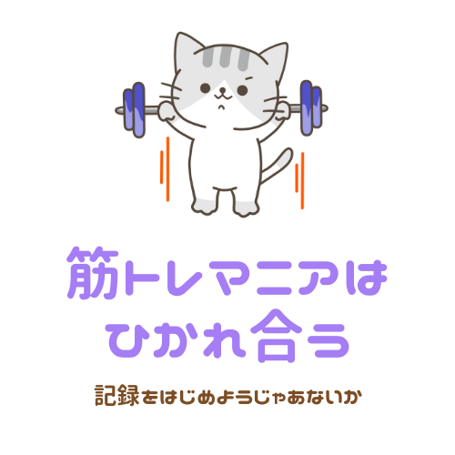

# 筋トレマニアはひかれ合う

## サイト概要
このサイトは筋トレのモチベーションを保ち続けるためのサイトです。

主な機能は３つ
1. __トレーニング内容の記録__ 
日ごとに鍛える部位別、種目、重量、回数などを記録できます。 
またトレーニングの記録はカレンダーで一覧として閲覧することができるので、びっしりとトレーニングで埋まったカレンダーをみて _にやにや_ しましょう。 

<!--日ごとに鍛える部位別、種目、重量、回数などを記録できます。 -->
<!--トレーニングの記録でのテーマは **【きのうの自分に負けるな】** です。 -->
<!--記録しはじめたら最後、前回の自分の記録を破り続ける戦いが始まります。 -->
<!--この一見無意味そうな自分との戦いがモチベーションを維持するいいスパイスになります。 -->
<!--またトレーニングの記録はカレンダーで一覧として閲覧することができるので、びっしりとトレーニングで埋まったカレンダーをみて _にやにや_ しましょう。 -->
<!--Githubに草を生やすだけでなく、筋トレカレンダーにも草を生やす生活をはじめましょう。 -->
<!--そのうち草を生やさずにはいられなくなります。 -->

1. __食事の管理__ 
自身の情報から摂取すべき **マクロ栄養素（P:たんぱく質、F:脂質、C:炭水化物、以下PFCバランス）** の量を割り出すことができます。 
一日単位で残りの摂取してよいカロリー、PFCバランスをグラフで簡単に確認することが可能です。 
毎日達成できる小さな目標（PFCバランスの目安）を持ち、日々クリアしていくことで適切な食事を取り続けることができます。 

<!--食事の管理でのテーマは **【最初はこだわりすぎるな】** です。 -->
<!--自身の情報から摂取すべき **マクロ栄養素（P:たんぱく質、F:脂質、C:炭水化物、以下PFCバランス）** の量を割り出すことができます。 -->
<!--一日単位で残りの摂取してよいカロリー、PFCバランスをグラフで簡単に確認することができ、このPFCバランスの数値さえ守れば、ケーキだろうとプリンだろうとなにを食べても文句は言いません。 -->
<!-- *3ヶ月後に10kg痩せよう!!それまでは減量食!!* というようなおおまかな目標設定だと続けることは困難です。 -->
<!--毎日達成できる小さな目標（PFCバランスの目安）を持ち、日々クリアしていくことで適切な食事を取り続けることができます。 -->
<!--最初は食材などにこだわりすぎず、PFCバランスのことだけを考えましょう。-->

1. __自分の身体の変化を記録（体重、体脂肪率、任意で写真）__ 
ボディメイクにおいて体重は一番わかり易い指標です。体重の変化もグラフで確認することができます。 
トレーニングとPFCバランスを守った食事で体重が減ったという小さな成功体験を積み重ねることでよりモチベーションUPが期待できます。 
自身の身体の写真も載せることができ、日々体型の変化を記録することができます。

### サイトテーマ
筋トレのモチベーションを保ち続けることを目的としたサイト

### テーマを選んだ理由
自分のだらしない体にむかっ腹が立ったことはないでしょうか？ 
空前のフィットネスブームでトレーニングを始める人が急増しております。 
しかしながらせっかくトレーニングを始めたのに、食事にはこだわらない人が多く、 *筋トレしても痩せない* と心が折れてトレーニングをやめてしまう人をたくさん見てきました。 
筋トレは **食事から始まる** と言っても過言ではありません。 
そこで、食事、筋トレ両方のモチベーションを保ち続けることができるサイトを作りたいと考えました。 
<!--健康的な体作りは１ヶ月、３ヶ月のような短期間の一時的なダイエットではなく、筋トレを日々の生活の一部にすることが大切だと私は考えています。 -->
<!--そのため最終的な究極目標は、このサイトの利用者全員が筋トレを生活の一部にして、当たり前のように日々運動をし続けるようになることです。-->

当サイトでモチベーションを保ち続けるために大切にしたことは以下の２点です。
1. __100分の1プランニング__ 
実現したい大きな目標を100分の1、もしくは1000分の1まで小さな目標、課題に分割し、毎日その小さな目標を達成することで大きな目標に近づくという考え方です。
* 筋トレ 
前回の自分の記録を１kg重く、1回多くするという毎回達成可能な小さな目標を設定しています。
* 食事 
１日で摂取して良いPFCバランスの数値を守るという毎日達成できる目標を設定しています。
2. __容易に自分の成長を振り返ることができる環境づくり__ 
このサイトで、筋トレ、食事、自身の身体の記録をすることで、容易に自分の成長、努力を振り返ることができます。 
少しずつでも成長していることに対する充実感や満足感によって、モチベーションを保つことができます。 

<!--人は周囲の人間と自分を比較することは無意識のうちにしていても、過去の自分と現在の自分を比較、つまり自己成長を確認することは怠りがちです。 -->
<!--このサイトで、筋トレ、食事、自身の身体の記録をすることで、容易に自分の成長、努力を振り返ることができます。 -->
<!--少しずつでも成長していることに対する充実感や満足感によって、モチベーションを保つことができます。 -->
<!--また、常に目標を達成し続ける感覚を得ることは、趣味や仕事などあらゆる場面でプラスに作用すると私は信じています。-->

### ターゲットユーザ
* 筋トレ、ダイエットに興味がある人
* 筋トレ、ダイエットを挫折してしまった人
* ジムに通ってはいるがイマイチ効果が出ない人

<!--* ガチ筋トレマンから週１ジムマンまで理想は全人類-->

### 主な利用シーン
* 💪筋トレ中
* 🍴食事前後

### 機能一覧
* アカウントを作成、基本情報を入力（性別、生年月日、身長、体重は必須項目）
* プロフィールに、画像、ホームジム、自己紹介など任意で追加可能
* 【食事】
  * 自身の情報から摂取すべきマクロ栄養素の量を計算
  * 一日で摂取できる残りのカロリー（PFCバランス）をグラフで視覚化
  * 食事の内容をマクロ栄養素(たんぱく質、脂質、炭水化物)とともに投稿
  * 写真も投稿可能
  * 一覧、詳細も確認できる。

* 【トレーニング】
  * トレーニングの内容を記録（鍛える部位別、種目、重量、回数、時間、有酸素運動など）
  * カレンダーにてトレーニングした日をひと目で閲覧可能
  * カレンダーからいつでも過去のトレーニング内容詳細を閲覧可能
  * 部位、種目の名前は自分で追加することもできる

* 【自分の身体の変化を記録】
  * 体重、体脂肪率等を投稿、グラフで視覚的に確認できる

  <!--* 自身の写真をつなぎ合わせ、体型の変化がわかるgifファイルを自動生成 ※優先度低い、可能かどうかも不明-->

<!--* 【可能であれば追加、優先度低い】-->
<!--  * SNS機能-->
<!--    * twitterのようにトレーニング内容を共有することができる-->
<!--    * モチベーションUPのための筋トレ格言を投稿できる-->
<!--    * いいね機能-->
<!--    * コメント機能-->
<!--    * フォロー、フォロワー機能-->
<!--    * ダイレクトメッセージ機能-->
<!--  * マッチング機能-->
<!--    * 自分の位置情報、任意の場所からこれから筋トレをする仲間を募集-->
<!--  * 仮会員としてすぐに利用することも可能に-->

## 設計書

## チャレンジ要素一覧
<https://docs.google.com/spreadsheets/d/1ianGQj4mt_a0knuvIow878XP_Cizjuab-dpr0HKRbQA/edit?usp=sharing>

## 開発環境
- OS：Linux(CentOS)
- 言語：HTML,CSS,JavaScript,Ruby,SQL
- フレームワーク：Ruby on Rails
- JSライブラリ：jQuery
- IDE：Cloud9

## 使用素材
 
* [イラストAC](https://www.ac-illust.com/)